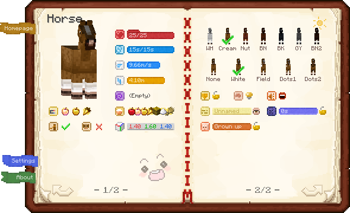
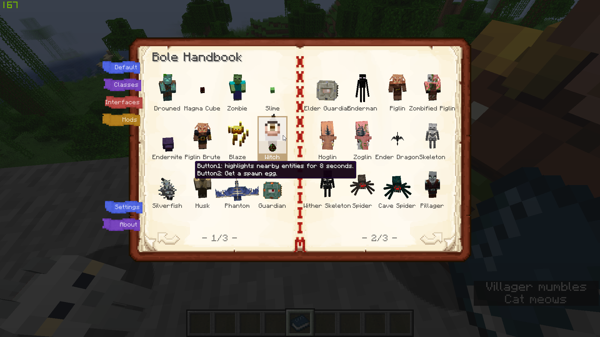
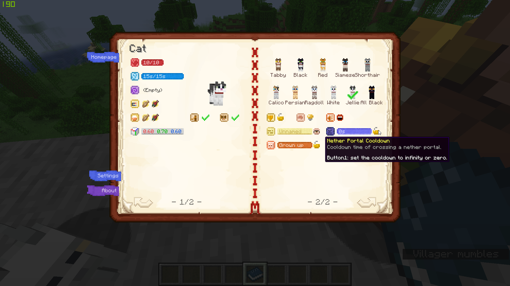
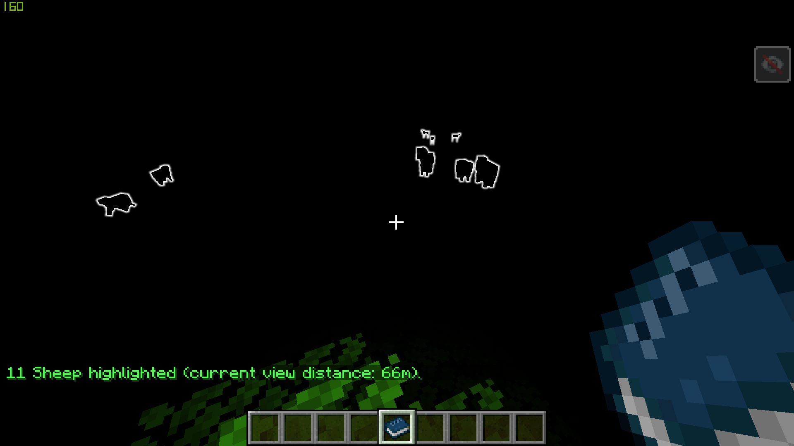
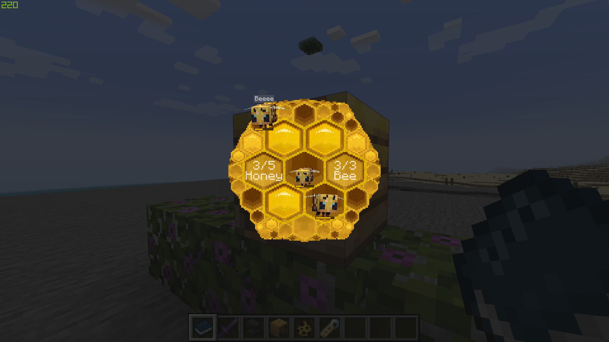

# Bole

A mod that displays information of creatures and provides some new optional
features about creatures.

This mod only works on `Fabric` side and depends on
[`Fabric API`](https://www.curseforge.com/minecraft/mc-mods/fabric-api).
No plan for `Forge` yet. You'd better install this mod on both client and server
side. But the game will still work fine if the mod is not installed
on both sides.

The principles that this mod adheres to:
- This mod is vanilla friendly. No new items, blocks or other custom data are added.
Even the item `Bole Handbook` is just a `writable_book` with some NBT tags.
So your saves will still be fine after uninstalling the mod.
- All the new features in the config menu (except for the features about the
bole handbook) are optional and are turned off by default.
- Game balance is taken into account. Players won't be too powerful in survival mode.

Please click the `☆ star` if you like this project~   ╰(￣▽￣)╭

## How to play

You can buy a bole handbook from a wandering trader (a wandering trader has a 20% chance
to carry this trade offer). Or you can get it from the creative inventory screen (it is at the
end of the misc group).

Hold the handbook and right-click an entity, and a screen will be opened which displays
some properties of the entity; right-click on the air and the homepage screen will be
opened. You can also open the screen by pressing the hotkey.

## Screenshots

|  |  |
| --- | --- |
|  |  |

## All Features

- [X] **`Buy Bole handbook from wandering traders`**
- [ ] **`Copy Bole handbook`**
- [X] **`Highlight entities around the player`**
  - [X] `Dyanamic view distance`
  - [X] `Costs experience`
- [X] **`Offer a spawn egg`**
- [X] **`Open the handbook screen when looking up`**
- [X] **`Open the player or vehicle screen when looking down`**
- [X] **`Notify the player when the leads fall`**
- Entity:
  - [X] `Bounding box`
  - [X] `Custom name`
  - [X] `Nether portal cooldown`
  - [X] `Set nether portal cooldown`
    - [X] `Players can only change their own cooldown`
  - [X] `Set custom name visible`
  - [X] `Shut up`
  - [X] `Set invulnerable`
  - [X] `Air`
  - LivingEntity:
    - [X] `Health`
    - [X] `Max health`
    - [X] `Is baby`
    - [X] `Status effects`
    - PlayerEntity
      - [X] `Experience`
    - MobEntity:
      - [X] `Attractive items` (goalSelector - TemptGoal)
      - [X] `Can be leashed` (canBeLeashedBy)
      - [X] `Disable AI`
      - PathAwareEntity:
        - PassiveEntity:
          - [X] `Set baby / Never grow up` (breedingAge)
          - AnimalEntity:
            - [X] `Breeding item` (isBreedingItem)
            - TameableEntity:
              - [X] `Is tamed`
              - [ ] `Set owner`
              - [X] `Block accidental injury`
              - [X] `Teleport to the owner on the sea and leaves`
              - TameableShoulderEntity:
                - [X] `Set cooldown of sitting on player`
                - ParrotEntity:
                  - [X] `Set variant`
                  - [X] `Show GUI when on shoulder`
                  - [ ] `Won't leave shoulder when player jumps`
                  - [ ] `Breedable`
              - CatEntity:
                - [X] `Set variant`
            - AbstractHorseEntity:
              - AbstractDonkeyEntity
                - [X] `Chest size`
              - HorseEntity:
                - [X] `Running speed`
                - [X] `Jump height`
                - [X] `Set variant`
            - BeeEntity:
              - [X] `Beehive position`
              - [X] `Reset beehive position`
              - [X] `Check beehive state`
            - SheepEntity:
              - [X] `Force to eat grass`
            - GoatEntity:
              - [X] `Set screamer`
            - RabbitEntity:
              - [x] `Set variant`
            - FoxEntity:
              - [x] `Set variant`
            - PandaEntity:
              - [X] `Set gene`
            - AxolotlEntity:
              - [X] `Set variant`
            - Goat:
              - [X] `Is Screaming`
          - MerchantEntity:
            - [X] `Get inventory`
            - [X] `Set inventory`
            - VillagerEntity:
              - [X] `Highlight job site`
              - [X] `Reset level 0`
              - [X] `Force  to restock`
              - [X] `Change clothes`
            - WanderingTraderEntity:
              - [X] `Notify players when spawned`
              - [X] `Despawn time`
              - [X] `Add Despawn time`
        - WaterCreatureEntity:
          - FishEntity:
            - SchoolingFishEntity:
              - TropicalFishEntity:
                - [X] `Set variant`
          - DolphinEntity:
            - [X] `Moistness`
        - HostileEntity:
          - AbstractPiglinEntity:
            - PiglinEntity:
              - [ ] `Pay to dance`

## Q&A

- **What does "Bole" mean?**
  Bo Le is a historical figure in ancient China who is a great horse connoisseur.
  As the original intention of this mod is to display various attributes of horses.
